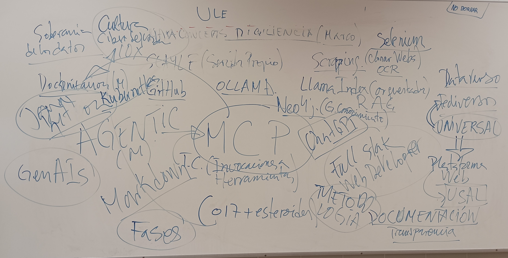

# Acta reunión 21-3-2025

- Inicio: 10:00
- Fin: 12:25

## Participantes

- Enrique
- Esteban
- Carlos
- Álvaro
- Ander
- César (online)
- Santiago (online)
- Gabriel (online)
  
## Temas tratados

- Transparencia del proyecto
- Gestión del proyecto
- Elección de herramienta de gestión: Tastkcade, Github...
- Documentación y gestión
- Rendimiento y productividad del equipo.
- Uso de herramientas: ChatGPT.
- Escrapeo y mapeo de carreras de ciberseguridad.

## Acuerdos y conclusiones

- Mayor transparencia. Se debe dejar constancia de todo el trabajo (Documentar).
- Elaboración de calendario y horario
- Se empleará Github como herramienta de gestión.
- Se elaborará un manual de uso de la herrmaienta de gestión.
- Mínima presencialidad en el lugar de trabajo.
- Gabriel: escrapeo Esquema Nacinal de Seguridad (ENS) del CNI.
- Gabriel: Mapeo de carreras de ciberseguridad.
- Ander: Cyber security carrer week (NIST).
- Se deben scrapear las imágenees.
- Álvaro: Estudio de MCP.
- Ander: rol de secretario.

## Comentarios y observaciones

