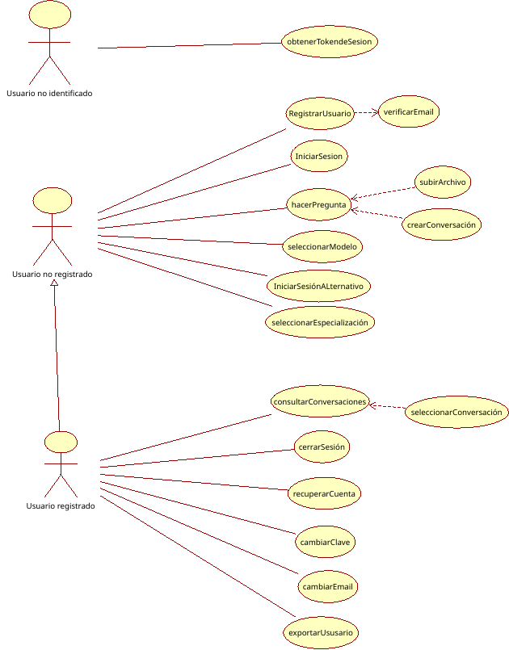

# Documento de Requsitos

El presente documento pretende fijar y dejar constancia de los objetivos y el alcance del proyecto. A continuación, se recoge la especificación general y técnica del proyecto, donde se detalla el resultado a obtener.

## Introducción

La realización de este proyecto responde a la necesidad de las instituciones de proveer a la ciudadanía de un servicio de IA conversacional (chatbot) especializado en asistencia ante incidentes y cuestiones de ciberseguridad.(BÁSICAMENTE LA MOTIVACIÓN)

## Descripción general
Desarrollo de un servicio web basado en inteligencia artificial conversacional (LLM) para atender consultas relacionadas con ciberseguridad. Este servicio proporcionará respuestas, información, consejos y guías sobre incidentes y medidas de ciberseguridad, amenazas, ciberataques y otros temas relacionados con el uso de tecnologías. Además, el servicio ofrecerá orientación de calidad sobre el desarrollo profesional en el ámbito de la ciberseguridad.

El servicio se adaptará al nivel de conocimiento, situación social o discapacidad del usuario para personalizar las respuestas. El perfil del usuario se construirá a partir de la información explícita proporcionada por el usuario (es decir, datos proporcionados directamente por él) y a partir de la conversación misma. Estos datos podrán ajustarse dinámicamente durante la interacción. La adaptación se reflejará en aspectos como el registro utilizado, los recursos audiovisuales (imágenes, voz, etc.), la complejidad de la información proporcionada (más técnica o más sencilla), la granularidad de las instrucciones, entre otros. El objetivo es facilitar la comprensión de las respuestas y maximizar la utilidad del servicio. El usuario también podrá ajustar ciertos parámetros de las respuestas, como la temperatura o el formato de la respuesta (texto, gráficos, etc.).

El servicio tomará en cuenta el contexto de la conversación para generar las respuestas.

Las respuestas se generarán según la situación actual en el momento de la consulta. Para ello, se mantendrá una base de datos actualizada continuamente con noticias, informes, artículos, imágenes y otros contenidos relevantes sobre ciberseguridad. Además, la información en la base de datos se actualizará de manera dinámica, periódica y automatizada a partir de fuentes accesibles en internet (mediante técnicas de scraping).

El servicio no responderá a consultas fuera del ámbito de la ciberseguridad, ni a preguntas impertinentes, inmorales o potencialmente ilegales. En particular, no atenderá cuestiones sensibles de índole política, religiosa o filosófica. Tampoco realizará juicios morales.

El servicio estará alojado dentro de la infraestructura de la organización, incluyendo todos los recursos necesarios, como la base de datos. El servicio será desplegado sobre un sistema operativo Linux (Ubuntu server).

El servicio debe ser capaz de atender a un gran número de usuarios simultáneos y ser escalable según la demanda.

Se especificarán los recursos necesarios y el número exacto de usuarios simultáneos que se podrán atender.

Para evitar la saturación del servicio, en caso de un aumento inusual de usuarios, se podrán restringir algunas funcionalidades para garantizar un nivel básico de servicio.

El tiempo de respuesta debe ser lo suficientemente rápido para asegurar una experiencia de usuario fluida. En el caso de respuestas con recursos audiovisuales, el tiempo de respuesta aceptable será mayor.

El servicio podrá ser utilizado sin necesidad de que el usuario se identifique previamente.

El servicio implementará medidas de seguridad para prevenir abusos y ataques, protegiendo la disponibilidad, confidencialidad e integridad tanto del servicio como de los datos de los usuarios.

La interfaz web deberá cumplir con los estándares y adaptarse a la legislación vigente en términos de accesibilidad, garantizando su uso por parte de cualquier usuario.

El servicio podrá almacenar temporalmente las conversaciones de los usuarios para retomarlas posteriormente. Para esto, los usuarios deberán estar registrados en la plataforma.

El servicio no deberá generar alucinaciones ni respuestas incorrectas; si esto ocurre, deben ser mínimas. En cuestiones sensibles, especialmente aquellas que puedan afectar la integridad física de las personas o tener graves consecuencias, se deberá prestar especial atención. Las respuestas del servicio estarán justificadas mediante citas a fuentes fiables que respalden la información proporcionada contributendo a la fiabilidad de la información.

En casos que requieran asesoramiento especializado o atención humana, el servicio remitirá al usuario a las instituciones o autoridades competentes. Si la temática de la conversación es grave, pertinente o si el usuario lo solicita, se podrá transferir la conversación a un operador humano (básicamente delegar al servicio 017).

El servicio podrá ser utilizado por el servicio 017 como apoyo.

El servicio generará datos estadísticos y registros de funcionamiento que permitirán realizar auditorías.

Se elaborará una guía de usuario.

El servicio, así como la documentación para el usuario, estará disponible en inglés, castellano y las lenguas cooficiales del Estado.

La página web deberá estar adpatada a dispositivos móviles.

### Wiki requisitos

MediaWikiGTL

## Requisitos

Especificación técnica de los requisitos.

### Funcionales

Los requisitos funcionales son aquellos que definen de forma exhaustiva la funcionalidad del sistema. Estos requisitos declaran qué hace el sistema

1. **Atención a consultas de ciberseguridad**:  
   El servicio deberá resolver dudas, proporcionar información, consejos y guías sobre ciberseguridad, incluyendo amenazas, ciberataques y medidas de seguridad.
   
2. **Adaptación al usuario**:  
   El servicio debe adaptarse al nivel de conocimiento, situación social o discapacidad del usuario, personalizando las respuestas basadas en datos proporcionados por el usuario y la conversación.
   
3. **Generación de respuestas contextualizadas**:  
   Las respuestas deben considerar el contexto de la conversación, y el servicio debe generar respuestas basadas en la situación actual en el momento de la consulta.

4. **Base de datos dinámica**:  
   El servicio actualizará periódicamente su contenido con noticias, informes, artículos e imágenes relacionadas con la ciberseguridad. (scrapping).

5. **Configuración de parámetros por el usuario**:  
   El usuario podrá ajustar características de la respuesta, como la temperatura o el medio de respuesta (texto, gráficos, etc.).

6. **IA especializada**:
   El modelo contará con configuraciones personalizadas enfocadas en temas concretos. Estas especializaciones dotarán a la IA del contexto y las herramientas para orientar al usuario de forma más directa y rápida. Estas especializaciones tratarán campos de la ciberseguridad y necesidades del usuario específicos. Uno de los enfoques será **orientación profesional en ciberseguridad**.

7. **Acceso sin identificación previa**:  
   El servicio podrá ser utilizado sin que el usuario tenga que identificarse previamente (sin cuenta de usuario).

8.  **Almacenamiento conversaciones**:  
   El servicio almacenará las conversaciones de los usuarios registrados para retomar la interacción más adelante.

9.  **Eliminación de conversaciones**:  
   Los usuarios podrán eliminar las conversaciones realizadas.

10. **Asesoramiento profesional**:  
   El servicio deberá ofrecer orientación sobre el desarrollo profesional en ciberseguridad de calidad.

11. **Justificación de respuestas**:  
   El servicio justificará sus respuestas citando fuentes fiables que las respalden.

12. **Remisión a asesoramiento especializado**:  
   Si se requiere, el servicio remitirá a los usuarios a instituciones o autoridades competentes, y en caso necesario, podrá pasar la conversación a un teleoperador humano.

13. **Asistencia al servicio $017$**:  
   El servicio podrá ser utilizado por el $017$ como asistencia.

14. **Generación de datos estadísticos**:  
   El servicio generará estadísticas de uso y registros de funcionamiento para su auditoría y mejora.

15. **Guía de usuario**:  
   Se creará una o varias guías de usuario para el servicio adaptadas al público general.

  

### No funcionales

Los requisitos no funcionales establecen el funcionamiento general del sistema. Estos requisitos establecen cómo el sistema realiza las tareas.

1. **Arquitectura**:  
   Será un servicio **web** que estará alojado dentro de la organización, junto con todos los recursos necesarios, como la base de datos, y será accesible desde un navegador **web** por parte de los usuarios.

7. **Compatibilidad de plataformas**:  
   El servicio debe ser accesible por lo menos desde los principales navegadores **web**.

#### Experiencia de usuario

3. **Tiempo de respuesta**:  
   El servicio debe garantizar tiempos de respuesta rápidos, especialmente para consultas básicas, mientras que las respuestas con recursos audiovisuales podrán tener un tiempo de respuesta más largo.

10. **Experiencia de usuario**:  
    El diseño de la interfaz y la interacción con el servicio deben ser fáciles de usar, proporcionando una experiencia fluida y satisfactoria al usuario.

11. **Accesibilidad**:  
   El servicio, y en especial la interfaz, deben cumplir con los estándares de accesibilidad para garantizar una correcta experiencia de usuario para el máximo número de ellos.

12. **Idiomas**:  
    El servicio y la documentación de usuario estarán disponibles en inglés, castellano y las lenguas cooficiales del Estado.

#### Escalabilidad

4. **Escalabilidad del servicio**:  
   El servicio debe ser capaz de escalar según el número de usuarios simultáneos que atiende.

2. **Mantenimiento de la calidad del servicio**:  
   En caso de un aumento inusual de usuarios, el servicio podrá limitar ciertas características para mantener un nivel básico de funcionamiento.

8. **Fiabilidad y disponibilidad**:  
   El servicio debe ser fiable, garantizando un alto tiempo de disponibilidad para evitar interrupciones en la atención a los usuarios.

9. **Actualización dinámica de contenido**:  
   La base de datos debe actualizarse de manera dinámica y automática, sin intervención manual para mantener la relevancia de la información.

12. **Desempeño en condiciones de alta carga**:  
    El servicio debe estar diseñado para manejar grandes volúmenes de tráfico y solicitudes sin experimentar caídas o ralentizaciones significativas.

13. **Facilidad de mantenimiento**:  
    El sistema debe ser fácil de mantener.

### Legales

14. **Privacidad y protección de datos**:  
    El servicio debe cumplir con la normativa vigente sobre protección de datos, garantizando la confidencialidad y la integridad de los datos del usuario.

15. **Legislación y cumplimiento**:  
    El servicio debe cumplir con todas las regulaciones aplicables en cuanto a privacidad, accesibilidad y otros aspectos legales pertinentes.

16. **Información del usuario**
    El usuario deberá poder recibir toda la información que el sistema contiene sobre él.

### Seguridad

17. **Seguridad**:  
   El servicio implementará medidas de seguridad para proteger la disponibilidad, confidencialidad e integridad del servicio y los datos de los usuarios.

5. **Seguridad contra abusos y ataques**:  
   El servicio debe ser resistente a abusos, ataques y vulnerabilidades, protegiendo tanto la infraestructura como los datos del usuario.

6. **Restricción de contenido**:  
   El servicio no responderá preguntas ajenas al ámbito de la ciberseguridad, ni cuestiones impertinentes, inmorales o ilegales, como temas de política, religión o proposiciones filosóficas. Además, no realizará valoraciones morales.

## CdU

La funcionalidad del servicio desde el punto de vista del usuario se ilustra en el siguiente diagrama de casos de uso.

En el documento técnico se describe detalladamente.