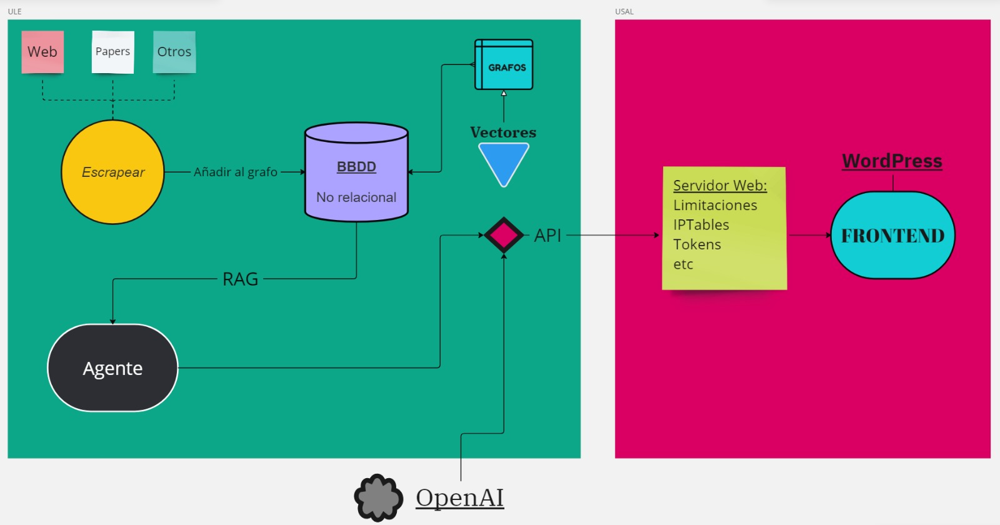
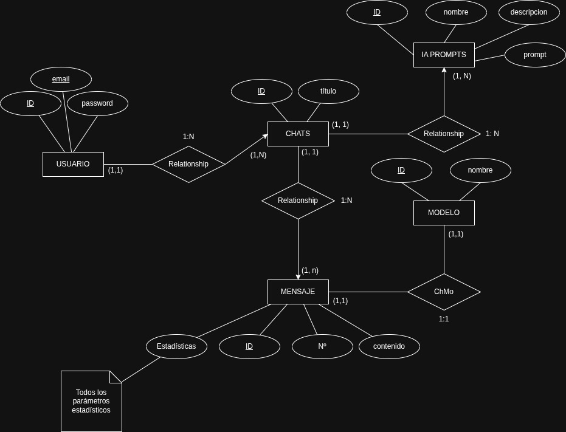

# Estructura del proyecto

Este documento presenta la estructura general del sistema, así como su justificación. No obstante, está sujeto a cambios.

## Arquitectura

La estructura del proyecto seguirá un esquema en tres capas (capas de presentación, lógica de negocio y persistencia) y estará compuesta por módulos aislados en contenedores, en principio Docker, y seguirá un esquema cliente-servidor. Todos los contenedores estarán en un servidor propio.

Los componentes serán
- los módulos de las bases de datos (SQL y orientada a grafos),
- el módulo del modelo LLM,
- el módulo de la lógica de negocio,
- el módulo del servidor web,
- el módulo de scrapeo
- y los módulos auxiliares del agente.

 El lado del cliente será una interfaz web que gestionará la interacción del usuario con el servicio, alojado en el servidor.
 
 Se especificará una API para la interacción entre diferentes módulos.

### Base de datos

Habrá dos bases de datos para cometidos diferentes:

- La BD de datos no relacional estará orientada a grafos y almacenará el resultado des escrapeo. Además, será empleada por el modelo de lenguaje para generar la respuesta.
- La BD SQL almacenará otros datos como estadísticas, datos de usuario o credenciales.
  

### Servicio web

La aplicación web realizará la gestión de usuarios y sesiones, delegando la generación de respuestas a la lógica de negocio.

La comunicación entre el cliente y el servidor se realizará principalmente mediante una interfaz de tipo API REST.

Para mejorar la experiencia de usuario durante la conversación se emplearán web sockets en la recepción de los mensajes para poder recibirlos de manera continua. Se evita así esperar hasta que se completa la respuesta para entregarla al usuario.

### LLM

El módulo del LLM únicamente contendrá el modelo de lenguaje y los recursos esenciales del mismo. Se definirá una API para su interacción con la lógica de negocio. Soportará múltiples modelos de lenguaje y de forma simultánea.

### Lógica de negocio

Este módulo se encarga de interactuar con el agente y de realizar todas las funcionalidades impropias del modelo de lenguaje. Representa toda la lógica salvo el modelo.

### Scrapeo

Escrapeará multitud de páginas web y recursos en línea. Incluirá la lógica necesaria para realizar el proceso periódicamente manteniendo la base de datos actualizada.

### Módulos auxiliares

Estos módulos representan más una división conceptual que práctica. Pueden ser desde modelos generadores de imágenes o vídeos hasta simples *prompts*. Estos módulos estarán a disposición del agente y su estructura de contenedores será más flexible. En función de su envergadura podrán implementarse en contenedores independientes o estar incluidos junto al agente.

### Especializaciones

Las configuraciones especializadas se basarán principalmente en *prompts* predefinidos junto a posibles herramientas concretas que podrán ser específicas de la especialización o modificación de las generales. 

## Justificación

La arquitectura cliente-servidor es la más utilizada en servicios web, ya que su esquema es ideal para este tipo de servicios. Además, la estructura típica de estos servicios presenta una clara distinción entre la presentación (*frontend*) y la lógica de negocio y persistencia (*backend*) que se refleja en el uso del modelo en tres capas.

Dentro de cada capa es también posible distinguir diferentes servicios o funcionalidades más o menos aisladas que podemos tratar como microservicios. Emplear una tecnología de contenerización para estos microservicios ayuda a mantener la portabilidad y a la gestión de dependencias. También contribuye a mejorar la seguridad del sistema a causa del aislamiento de los servicios.

EL uso de una API REST como interfaz entre el cliente y el servidor es una forma simple y eficiente de realizar la comunicación que es ampliamente utilizada en el ámbito de los servicios web y que mejora protocolos anteriores como SOAP. Además, al ser un protocolo estándar y sencillo es más fácil de implementar, mantener y proteger.

Usar una API como interfaz entre los componentes limita la comunicación y un excesivo acoplamiento entre los mismos. De esta forma se facilita su mantenimiento y se reduce la superficie de ataque.

Las BD orientadas a grafos son ideales para ser usadas por modelos de IA dada la forma en la que estos gestionan la información mientras que la base datos SQL es mejor para el resto de datos.

La segregación de las herramientas del agente responde, como ya se ha adelantado, a una estructura lógica más que práctica. Puesto que estas herramientas pueden ser muy dispares, desde grandes servicios de generación de imágenes a simples *prompts* o consultas a la base de datos su diseminación en contenedores puede no estar justificada o ser contraproducentes. Por tanto, es posible que se integren directamente en el módulo de lógica de negocio o en el del modelo.

## CdU

En esta sección se presentan los casos de uso (CdU) de la aplicación desde el punto de vista del usuario y la interfaz REST.

### CdU del usuario

#### Actores

| Nombre                 | Descripción                       |
| ---------------------- | --------------------------------- |
| Usuario no autenticado | Usuario que no posee un *token* de sesión válido |
| Usuario no registrado | Usuario que no ha iniciado sesión en el sistema pero posee un *token* de sesión válido. |
| Usuario registrado    | Usuario que ha inciado sesión en el sistema (y cuenta con un *token* válido)              |

#### Acciones

| **Nombre**                  | **Precondición**                                 | **Postcondición**                                                                                                    | **Excepción**                                                                                                                       | **Descripción**                                                                                                                                                                                                                                                                                                                       |
| --------------------------- | ------------------------------------------------ | -------------------------------------------------------------------------------------------------------------------- | ----------------------------------------------------------------------------------------------------------------------------------- | ------------------------------------------------------------------------------------------------------------------------------------------------------------------------------------------------------------------------------------------------------------------------------------------------------------------------------------- |
| **obtenerToken**           | El usuario no posee un *token* de sesión válido                   | El usuario recibe un *token* de sesión                                                                                          | -                                                             | El sistema crea un *token* de sesión para el usuario y se lo envía. El usuario pasa a ser un usuario no registrado.|
| **RegistrarUsuario**        | El usuario no ha iniciado sesión                 | El usuario queda registrado en la base de datos e inicia sesión                                                      | Si el correo electrónico no está verificado, el registro no se realiza.                                                             | El usuario ingresa un correo electrónico y una contraseña para el registro. El sistema verifica que el correo no esté en uso y envía un mensaje de verificación al correo proporcionado. El usuario sigue el enlace de verificación para validar su cuenta. Finalmente, el sistema registra al usuario y le otorga acceso al sistema. |
| **IniciarSesion**           | El usuario no está autenticado                   | El usuario queda autenticado                                                                                         | Si las credenciales o el CAPTCHA son incorrectos, se deniega el acceso.                                                             | El usuario introduce su correo electrónico y contraseña junto con la verificación CAPTCHA. El sistema valida las credenciales y, si son correctas, devuelve un *token* de sesión que otorga acceso al usuario.                                                                                                                          |
| **InicioSesionAlternativo** | El usuario no está autenticado                   | El usuario queda autenticado.                                                                                        | Si la cuenta de la red social no está asociada a una cuenta en el sistema o las credenciales son incorrectas, se deniega el acceso. | El usuario selecciona la opción de iniciar sesión mediante una red social (Google, Facebook, etc.). El sistema redirige al usuario a la plataforma de la red social para autenticarlo. Si la autenticación es exitosa, el sistema vincula la cuenta de la red social con el usuario y le otorga acceso al sistema.                    |
| **HacerPregunta**           | El usuario está autenticado                      | El usuario recibe una respuesta                                                                                      | Si la pregunta es mal formulada o el sistema no puede procesarla, se devuelve un error.                                             | El usuario escribe una pregunta en forma de texto. El sistema procesa la solicitud y devuelve una respuesta en texto, basado en el modelo de conversación seleccionado.                                                                                                                                                               |
| **RecuperarCuenta**         | El usuario no está autenticado                   | El usuario recibe un enlace o código para restablecer su contraseña                                                  | Si el correo electrónico no está registrado, no se puede proceder con la recuperación.                                              | El usuario ingresa su correo electrónico para recibir un enlace de recuperación. El sistema envía un correo con un enlace o un código temporal que permite al usuario restablecer su contraseña. Si el correo no está asociado con ninguna cuenta, el sistema no envía ningún mensaje, pero no notifica al usuario.                   |
| **CerrarSesion**            | El usuario está autenticado                      | El usuario deja de estar autenticado (el token de sesión es invalidado)                                              | Si el token no es válido o ha expirado, la sesión no puede cerrarse.                                                                | El usuario solicita cerrar sesión. El sistema invalida el token de sesión, lo que desconecta al usuario del sistema de forma segura.                                                                                                                                                                                                  |
| **CambiarClave**            | El usuario está autenticado                      | La contraseña del usuario es modificada                                                                              | Si la contraseña actual es incorrecta, la modificación no se realiza.                                                               | El usuario introduce su contraseña actual y una nueva contraseña. El sistema verifica que la contraseña actual es correcta, actualiza la contraseña en la base de datos y asegura la seguridad del proceso invalidando el token de sesión actual.                                                                                     |
| **CambiarEmail**            | El usuario está autenticado                      | La dirección de correo electrónico del usuario es modificada                                                         | Si la contraseña actual o el nuevo correo electrónico son incorrectos, no se realiza el cambio.                                     | El usuario introduce su contraseña actual y la nueva dirección de correo electrónico. El sistema verifica que la contraseña es correcta, envía un correo de verificación al nuevo correo y espera la confirmación del usuario para actualizar la dirección. El token de sesión actual queda invalidado tras el cambio.                |
| **ConsultarConversaciones** | El usuario está autenticado                      | El usuario recibe los títulos de las conversaciones                                                                  | Si no hay conversaciones asociadas, se devuelve una lista vacía.                                                                    | El sistema devuelve una lista con los títulos de las conversaciones previamente iniciadas por el usuario.                                                                                                                                                                                                                             |
| **VerificarEmail**          | El usuario ha recibido un correo de verificación | El correo electrónico es verificado y la cuenta queda activada                                                       | Si el enlace ya ha sido utilizado o ha expirado, no se realiza la verificación.                                                     | El usuario accede al enlace proporcionado en el correo de verificación. El sistema valida el enlace y activa la cuenta del usuario, permitiéndole acceder a todas las funcionalidades del sistema.                                                                                                                                    |
| **SeleccionarConversación** | El usuario está autenticado                      | El usuario recibe la conversación solicitada. Las siguientes preguntas se realizarán dentro de la nueva conversación | Si la conversación no existe o no pertenece al usuario, se devuelve un error.                                                       | El usuario selecciona la conversación que desea consultar. El sistema verifica que la conversación existe y que pertenece al usuario, luego la envía al usuario para continuar la interacción.                                                                                                                                        |
| **SeleccionarModelo**       | El usuario está autenticado                      | Se establece un nuevo modelo para las preguntas                                                                      | Si el usuario no está autenticado, el acceso a ciertos modelos puede estar restringido.                                             | El usuario selecciona entre los modelos disponibles, los cuales pueden variar dependiendo de si el usuario está autenticado o no. Después de la selección, todas las futuras preguntas se procesarán con el modelo elegido.                                                                                                           |
| **SeleccionarEspecialización**       | El usuario está autenticado                      | Se establece una especialización para las preguntas en una nueva conversación.                                                                      | Si el usuario no está autenticado, el acceso a ciertas especializaciones puede estar restringido.                                             | El usuario selecciona entre las especializaciones disponibles, los cuales pueden variar dependiendo de si el usuario está autenticado o no. AL selecionar una especialización se crea una nueva conversación. La especialización no puede variar dentro de una conversación.                                                                |
| **crearConversación**       | El usuario está autenticado                      | Se crea una conversación.                                                                      | Si el usuario no está autenticado, la conversación anterior es eliminada.                                             | Se genera la entrada de la nueva conversación. También se genera el título de la misma a partir de la primera pregunta.                                                                |
### de la API REST