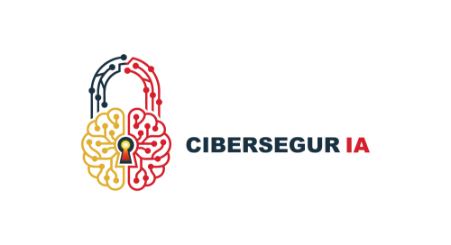

# Digiliencia - Plataforma Conversacional de IA para Ciberseguridad



**Tabla de Contenidos**
- [Características Técnicas](#características-técnicas)
- [Tech Stack](#tech-stack)
- [Arquitectura](#arquitectura)
- [Diseño e Implementación](#diseño-e-implementación)
- [Funcionamiento del Sistema](#funcionamiento-del-sistema)
- [Instalación](#instalación)
- [Configuración](#configuración)
- [Endpoints de API](#endpoints-de-api)
- [Testing](#testing)
- [Deployment](#deployment)
- [Autores](#autores)

## Características Técnicas

Platforma de IA conversacional (chatbot) basada en agentes, con persistencia en Neo4j (Knowledge Graph) y PostgreSQL, orquestada mediante FastAPI con LLM local (Ollama) e inferencia de embeddings.

### Core Intelligence
- **Sistema Multi-Agente Orquestado**: RouterAgent (orquestador inteligente) → NewsAgent (RAG) | ConversationalAgent
- **RAG Pipeline (Retrieval-Augmented Generation)**: Consultas fundamentadas en Neo4j knowledge graph con embeddings vectoriales
- **Shared Conversation Memory**: Contexto distribuido entre agentes.
- **LLM Local**: Ollama detrás de FastAPI - sin envío de datos a terceros, soberanía garantizada
- **Embeddings Vectoriales**: Búsqueda semántica en Neo4j.

### Base de Conocimiento
- **30.000+ artículos procesados**: Base de conocimiento de noticias técnicas y artículos de ciberseguridad
- **Clasificación automática**: Etiquetado taxonómico sin intervención humana (amenazas, sectores, impacto potencial)
- **Knowledge Graph Neo4j**: Nodos (News, Topic, Field, Chunk, Person, Organization) con relaciones complejas
- **Normalización de fuentes heterogéneas**: Procesamiento de información de múltiples proveedores (WEForum, NIST, etc.)
- **Actualización continua**: Flujos diarios de datos nuevos mantienen base actualizada

### Persistencia de Datos
- **PostgreSQL Relacional**: Usuarios, chats, mensajes, prompts, modelos (ACID transactions)
- **Neo4j Vector Store**: Embeddings vectoriales para búsqueda semántica y razonamiento asistido

### Seguridad & Control
- **JWT Bearer Tokens**: Authentication via fastapi-users, algoritmo HS256
- **Rate Limiting**: slowapi - 1000 req/min por defecto basado en IP
- **CORS Granular**: Configuración de orígenes permitidos
- **Security Headers**: HSTS, CSP, X-Content-Type-Options, X-Frame-Options
- **Session Management**: Redis con cleanup automático de sesiones inactivas
- **Async/Await Full Stack**: Prevención de blocking I/O, máxima concurrencia

### Ingesta de Datos
- **Web Scrapers Modulares**: Selenium + webdriver-manager para navegación simulada
- **Superación de Anti-Bot**: Gestión de headers, JavaScript dinámico, múltiples identidades
- **Normalización Automática**: Procesamiento de fuentes heterogéneas
- **Clasificación IA**: Etiquetado taxonómico automático (amenazas, sectores, impacto)

---

## Tech Stack

| Capa | Tecnología | Versión | Propósito |
|------|-----------|---------|----------|
| **Runtime** | Python | 3.13+ | Async/await nativo |
| **Web Framework** | FastAPI + Starlette | Latest | ASGI async server |
| **Auth** | fastapi-users + JWT | 15.0.1+ | OAuth2 Bearer token auth |
| **DB Relacional** | PostgreSQL + SQLAlchemy | 2.0+ async | Usuarios, chats, mensajes |
| **DB Async Driver** | asyncpg | 0.30.0+ | PostgreSQL optimizado async |
| **DB Grafo** | Neo4j + neomodel | 5.28 / 5.5.0+ | Knowledge graph + vector index |
| **Embeddings** | LlamaIndex | 0.14.2+ | RAG, vector search, chains |
| **LLM Local** | Ollama | Latest | Inference local (llama3.1:8b, etc.) |
| **Cache/Sessions** | Redis | 7+ | Sesiones distribuidas, locks |
| **Rate Limiting** | slowapi | 0.1.9+ | Token bucket rate limiting |
| **HTTP Client** | httpx | Latest | HTTP async client |
| **Web Scraping** | Selenium | 4.31.0 | Navegación simulada |
| **Logging** | loguru | Latest | Logs estructurados |
| **Testing** | pytest + pytest-asyncio | 8.3.5+ | Tests unitarios e integración |
| **Config** | pydantic-settings | Latest | Variables de entorno |

---

## Arquitectura

### Componentes Principales

#### 1. Sistema Multi-Agente (`digiliencia/agents/`)

**Clase Base: BaseAgent (ABC)**
```python
class BaseAgent:
    - name: str
    - model_name: str (ollama model)
    - temperature: float (generation sampling)
    - verbose: bool (logging)
    - memory: SharedConversationMemory (contexto compartido)
    - llm: OllamaLLM (conexión a Ollama)
    
    @abstractmethod
    async process_query(query: str) -> str
```

**RouterAgent** (Orquestador Inteligente)
- Analiza intent de query (NEWS, SECURITY, GENERAL)
- Enruta a NewsAgent si es sobre información estructurada
- Enruta a ConversationalAgent si es conversación general
- Temperature: 0.1 (bajo para routing consistente)
- Retorna respuesta del agente especializado

**NewsAgent** (RAG sobre Knowledge Graph)
```
1. EmbeddingService.embed_text(query)
2. Neo4j Vector Search: MATCH (n:News) WHERE distance(n.embedding, query_vec) < threshold
3. Retrieval: Nodos News + Topics + Fields contexto
4. Prompt: system_prompt + retrieved_context + conversation_history
5. Ollama LLM: generate_response()
6. Return: respuesta fundamentada con fuentes verificables
```

**ConversationalAgent**
- Conversación general sin acceso a base de datos específica
- Accede a SharedConversationMemory para continuidad
- Temperature: 0.7 (más creativo, pero controlado)
- Usa system prompt configurado para la sesión

**SharedConversationMemory**
```python
class SharedConversationMemory:
    - max_history: int = 50 (mensajes totales)
    - context_window: int = 10 (últimos para LLM)
    - messages: List[ConversationMessage]  # role, content, timestamp, agent_name
    
    def add_message(role, content, agent_name)
    def get_context_window() -> str  # Últimos N para prompt
```

#### 2. FastAPI Backend (`digiliencia/fastAPI/`)

**Estructura de Directorios**
```
fastAPI/
├── main.py                 # Entry point, lifespan, middlewares
├── tasks.py               # periodic_cleanup() background task
├── core/
│   ├── config.py          # Settings: DB, Redis, JWT, CORS
│   ├── endpoints.py       # Constantes de rutas
│   ├── agent_manager.py   # Orquestación de sesiones de agentes
│   └── redis.py           # Pool de conexiones Redis
├── auth/
│   ├── transport.py       # BearerTransport + JWTStrategy
│   └── users.py           # fastapi-users routers
├── db/
│   ├── models.py          # SQLAlchemy ORM
│   └── session.py         # AsyncSession factory
├── schemas/
│   ├── user.py            # Pydantic schemas (login, register, etc.)
│   └── chat.py            # Message, Response schemas
└── api/
    ├── routers/
    │   ├── chats.py       # Conversaciones
    │   ├── models.py      # Listar modelos IA
    │   ├── templates.py   # Prompts/personas
    │   ├── custom_auth.py # Auth custom
    │   └── custom_users.py
    └── v2/                # Versión 2 del API
```

**Lifespan Management**
```python
@asynccontextmanager
async def lifespan(app: FastAPI):
    # Startup
    if not TESTING:
        cleanup_task = asyncio.create_task(periodic_cleanup())
        # Limpia sesiones inactivas cada AGENT_CLEANUP_INTERVAL_MINUTES
    
    yield
    
    # Shutdown
    if cleanup_task:
        cleanup_task.cancel()
        try:
            await cleanup_task
        except asyncio.CancelledError:
            pass
```

**Middlewares Aplicados**

1. **CORS**
   - Orígenes: `settings.ALLOWED_ORIGINS` (JSON parseable)
   - Credenciales: enabled
   - Métodos: `*` (todos)

2. **Security Headers**
   - HSTS: 63072000s (prod) / 31536000s (dev)
   - CSP: Relajada para /docs, estricta para API
   - X-Content-Type-Options: nosniff
   - X-Frame-Options: DENY
   - Permissions-Policy: camera=(), microphone=(), geolocation=()

3. **Rate Limiting** (slowapi)
   - Global: 1000 req/min (configurable)
   - Key: IP remota
   - Excepciones: handlers personalizados

#### 3. Modelos de Datos

**PostgreSQL (SQLAlchemy 2.0 Async)**

```sql
users
├── id (UUID, PK)
├── email (str, unique)
├── hashed_password
├── is_active, is_superuser, is_verified

chats
├── id (UUID, PK)
├── user_id (FK → users)
├── title (str, max 255)
├── ai_prompt_id (FK → ai_prompts, nullable)
├── model_id (FK → models, nullable)
├── created_at, updated_at (timestamp tz)

messages
├── id (UUID, PK)
├── chat_id (FK → chats)
├── role (str: "user" | "assistant")
├── content (text)
├── created_at

ai_prompts
├── id (UUID, PK)
├── name (str, unique)
├── system_prompt (text)
├── description
├── created_at

models
├── id (UUID, PK)
├── name (str, unique)
├── provider (str: "ollama", "custom")
├── parameters (JSON)
├── created_at
```

**Neo4j (neomodel)**

```
News (label: News)
├── header, content, date, source, url
├── embedding: List[float] (vector)
├── HAS_TOPIC → Topic
├── HAS_FIELD → Field
├── HAS_CHUNK → Chunk (segmentos para granularidad)
├── MENTIONS → Person
└── MENTIONS → Organization

Topic (label: Topic)
├── name (unique)
├── description

Field (label: Field)
├── name (unique)

Chunk (label: Chunk)
├── text (fragmento del artículo)
├── sequence (posición)
├── embedding: List[float]

Person, Organization
├── name, type attributes
```

---

## Diseño e Implementación

### Flujo de Autenticación

```
1. POST /api/auth/register
   ├─ Valida email + password
   ├─ Hash password (bcrypt vía fastapi-users)
   ├─ Guarda en PostgreSQL
   └─ Retorna UserRead (UUID, email, is_active)

2. POST /api/auth/login
   ├─ Valida credenciales
   ├─ Genera JWT token (HS256, payload con user.id)
   ├─ TTL: ACCESS_TOKEN_EXPIRE_SECONDS (default 3600s)
   └─ Retorna {"access_token": "...", "token_type": "bearer"}

3. Request con JWT
   ├─ Header: Authorization: Bearer <token>
   ├─ Middleware valida signature + expiry
   ├─ Inyecta current_user en endpoint
   └─ Request autorizado
```

### Pattern Agent Manager

```python
class AgentManager:
    - agents_cache: Dict[chat_id, Tuple[RouterAgent, NewsAgent, ConversationalAgent]]
    - redis_client: Redis (para persistencia distribuida)
    
    async def get_or_create_conversation_agent(chat_id: UUID) -> RouterAgent:
        # Check Redis: agent_session_{chat_id}
        
        if exists:
            load from Redis
            update last_activity
        else:
            # Primera vez: crea agentes
            shared_memory = SharedConversationMemory()
            router = RouterAgent(memory=shared_memory)
            news = NewsAgent(memory=shared_memory)
            conv = ConversationalAgent(memory=shared_memory)
            
            cache en Redis
            set TTL = AGENT_SESSION_TIMEOUT_MINUTES
        
        return router_agent
```

### Pattern RAG

```python
async def process_query_with_rag(query: str) -> str:
    # 1. Embedding
    query_embedding = await embedding_service.embed_text(query)
    
    # 2. Vector Search en Neo4j
    results = neo4j.query("""
        MATCH (n:News)
        WHERE size(n.embedding) > 0
        WITH n, gds.similarity.cosine(n.embedding, $query_vec) AS score
        WHERE score > 0.7
        RETURN n LIMIT 5
    """, query_vec=query_embedding)
    
    # 3. Retrieval de contexto
    context = "\n".join([
        f"- {node.header}: {node.content[:500]}..."
        for node in results
    ])
    
    # 4. Inyección en prompt
    prompt = f"""
{system_prompt}

Contexto de noticias relacionadas:
{context}

Historial de conversación:
{memory.get_context_window()}

Usuario: {query}
"""
    
    # 5. LLM generation
    response = await ollama_llm.generate(prompt)
    
    # 6. Guardar en memoria
    memory.add_message(role="assistant", content=response, agent_name="NewsAgent")
    
    return response
```

---

## Flujo de Scraping (Ingesta de Datos)

```
1. Scraper Modular (Selenium)
   ├─ Navega portal dinámico
   ├─ Supera anti-bot (headers, delays, rotación de IPs)
   └─ Extrae HTML/JSON

2. Normalización
   ├─ Parse: header, content, date, source
   ├─ Clean: whitespace, encoding
   ├─ Validate: contra schema ScrapedNews
   └─ Deduplicate: url + content hash

3. Clasificación Automática (IA)
   ├─ Topic classification: NIST, WEF, CCOB, tendencias...
   ├─ Field classification: Vulnerabilidades, amenazas, sectores...
   ├─ Impact assessment: Critical, High, Medium, Low
   └─ Etiquetado automático sin intervención humana

4. Embedding Generation
   ├─ EmbeddingService.embed_text(content)
   ├─ Genera vector float[] (dimension configurable)
   └─ Chunk management: fragmentos para granularidad

5. Ingesta en Neo4j
   ├─ CREATE News node con embedding
   ├─ CREATE/LINK Topic, Field, Chunk nodes
   ├─ CREATE MENTIONS relations para Person/Organization
   └─ Index vector para búsqueda semántica

6. Persistencia
   ├─ Neo4j graph persistent
   ├─ PostgreSQL logs/metadata
   └─ Cache invalidation en Redis si existe
```

---

## Instalación

### Requisitos Previos

- **Python** 3.13+
- **PostgreSQL** 13+
- **Neo4j** 5.x
- **Redis** 7.x
- **Ollama** (LLM local)

### Paso 1: Clonar y Entorno

```bash
git clone https://github.com/Digiliencia/InfraestructuraDigiliencia.git
cd InfraestructuraDigiliencia

# Crear venv con uv (recomendado)
uv venv --python 3.13
source .venv/bin/activate

# O con venv nativo
python3.13 -m venv .venv
source .venv/bin/activate
```

### Paso 2: Instalar Dependencias

```bash
# Con uv
uv sync

# O con pip
pip install -e .
```

### Paso 3: Iniciar Servicios Externos (Docker)

```bash
# PostgreSQL
docker run -d \
  --name postgres \
  -e POSTGRES_USER=digiliencia \
  -e POSTGRES_PASSWORD=secure123 \
  -e POSTGRES_DB=digiliencia_db \
  -p 5432:5432 \
  postgres:15-alpine

# Neo4j
docker run -d \
  --name neo4j \
  -e NEO4J_AUTH=neo4j/neo4j_password_123 \
  -p 7687:7687 -p 7474:7474 \
  neo4j:5.28

# Redis
docker run -d \
  --name redis \
  -p 6379:6379 \
  redis:7-alpine

# Ollama (en terminal separada, requiere instalación previa)
ollama serve
# En otra terminal:
ollama pull llama3.1:8b
ollama pull nomic-embed-text
```

### Paso 4: Configurar .env

```bash
# Crear .env en raíz del proyecto
cat > .env << 'EOF'
# FastAPI
FASTAPI_HOST=0.0.0.0
FASTAPI_PORT=8080
ENVIRONMENT=development
TESTING=false

# PostgreSQL
POSTGRES_USER=digiliencia
POSTGRES_PASSWORD=secure123
POSTGRES_SERVER=localhost
POSTGRES_PORT=5432
POSTGRES_DB=digiliencia_db

# Neo4j
NEO4J_USERNAME=neo4j
NEO4J_PASSWORD=neo4j_password_123
NEO4J_URL=bolt://localhost:7687

# Redis
REDIS_HOST=localhost
REDIS_PORT=6379

# JWT
JWT_SECRET_KEY=your-secret-key-at-least-32-bytes-long
JWT_ALGORITHM=HS256
ACCESS_TOKEN_EXPIRE_SECONDS=3600

# CORS
ALLOWED_ORIGINS=["http://localhost:3000","http://localhost:8080"]

# LLM
LLM_URL=http://localhost:11434
CHATBOT_LLM=llama3.1:8b
CLASSIFICATION_MODEL=neural-chat

# Embeddings
EMBEDDINGS_SERVICE=http://localhost:8090
EMBEDDINGS_PROVIDER=ollama
EMBEDDINGS_MODEL=nomic-embed-text
EMBEDDINGS_DIMENSION=768

# News Processing
NEWS_CHUNK_SIZE=2000
NEWS_CHUNK_OVERLAP=200

# Agentes
AGENT_SESSION_TIMEOUT_MINUTES=30
AGENT_CLEANUP_INTERVAL_MINUTES=10
EOF
```

### Paso 5: Inicializar Bases de Datos

```bash
# PostgreSQL - crear tablas
python -c "
from digiliencia.fastAPI.db.models import Base
from digiliencia.fastAPI.db.session import engine
import asyncio

async def init_db():
    async with engine.begin() as conn:
        await conn.run_sync(Base.metadata.create_all)

asyncio.run(init_db())
"

# Neo4j - crear índices y constraints (via browser o CLI)
# http://localhost:7474 (UI)
# Crear índice vector en Neo4j Workspace
```

### Paso 6: Iniciar Backend

```bash
cd digiliencia/fastAPI
uvicorn main:app --host 0.0.0.0 --port 8080 --reload
```

Acceder a:
- API docs (Swagger): http://localhost:8080/api/docs
- ReDoc: http://localhost:8080/api/redoc
- Health check: http://localhost:8080/api/health

---

## Configuración

### Variables de Entorno Críticas

```bash
# Base de Datos
POSTGRES_USER, POSTGRES_PASSWORD, POSTGRES_SERVER, POSTGRES_PORT, POSTGRES_DB
NEO4J_USERNAME, NEO4J_PASSWORD, NEO4J_URL
REDIS_HOST, REDIS_PORT

# Autenticación
JWT_SECRET_KEY   # Mínimo 32 bytes en base64, mantener secreto
JWT_ALGORITHM    # HS256 (firmado simétricamente)
ACCESS_TOKEN_EXPIRE_SECONDS  # TTL del token (default 3600s = 1 hora)

# LLM & Embeddings
LLM_URL          # Endpoint Ollama (default http://localhost:11434)
CHATBOT_LLM      # Modelo ollama (e.g., llama3.1:8b)
EMBEDDINGS_MODEL # Modelo embeddings (e.g., nomic-embed-text)
EMBEDDINGS_DIMENSION  # Dimensionalidad (768, 1024, etc.)

# Sesiones
AGENT_SESSION_TIMEOUT_MINUTES   # Destruir agente si inactivo (default 30 min)
AGENT_CLEANUP_INTERVAL_MINUTES  # Frecuencia de cleanup (default 10 min)

# CORS
ALLOWED_ORIGINS  # JSON list de dominios permitidos
```

### PostgreSQL Schema

Ejecutar en psql:
```sql
CREATE DATABASE digiliencia_db;
\c digiliencia_db;
-- Las tablas se crean automáticamente vía SQLAlchemy (migrate)
```

### Neo4j Setup

Ejecutar en Cypher (http://localhost:7474):
```cypher
-- Crear índices
CREATE CONSTRAINT unique_news_url IF NOT EXISTS
  FOR (n:News) REQUIRE n.url IS UNIQUE;

CREATE INDEX idx_news_embedding IF NOT EXISTS
  FOR (n:News) ON (n.embedding);

CREATE CONSTRAINT unique_topic_name IF NOT EXISTS
  FOR (t:Topic) REQUIRE t.name IS UNIQUE;

-- Vector index (Neo4j 5.3+)
CALL db.index.vector.createIndex("news-embeddings", {
  label: "News",
  property: "embedding",
  dimensions: 768,
  similarity_function: "cosine"
});
```

---

## Endpoints de API

### Autenticación

**POST /api/auth/register**
```bash
curl -X POST http://localhost:8080/api/auth/register \
  -H "Content-Type: application/json" \
  -d '{
    "email": "user@example.com",
    "password": "securepass123"
  }'

Response 201:
{
  "id": "550e8400-e29b-41d4-a716-446655440000",
  "email": "user@example.com",
  "is_active": true
}
```

**POST /api/auth/login**
```bash
curl -X POST http://localhost:8080/api/auth/login \
  -H "Content-Type: application/json" \
  -d '{
    "email": "user@example.com",
    "password": "securepass123"
  }'

Response 200:
{
  "access_token": "eyJhbGciOiJIUzI1NiIsInR5cCI6IkpXVCJ9...",
  "token_type": "bearer"
}
```

### Chat Management

**GET /api/chats/conversations** (Listar chats del usuario)
```bash
curl -X GET http://localhost:8080/api/chats/conversations \
  -H "Authorization: Bearer <token>"

Response 200:
[
  {
    "id": "550e8400-e29b-41d4-a716-446655440001",
    "title": "Análisis de Vulnerabilidades",
    "ai_prompt_id": null,
    "model_id": null,
    "created_at": "2024-01-15T10:30:00Z",
    "updated_at": "2024-01-15T14:20:00Z"
  }
]
```

**POST /api/chats/conversations** (Crear chat)
```bash
curl -X POST http://localhost:8080/api/chats/conversations \
  -H "Authorization: Bearer <token>" \
  -H "Content-Type: application/json" \
  -d '{
    "title": "Nueva Conversación"
  }'

Response 201:
{
  "id": "550e8400-e29b-41d4-a716-446655440002",
  "title": "Nueva Conversación",
  "created_at": "2024-01-15T15:00:00Z"
}
```

**POST /api/chats/{chat_id}/messages** (Enviar mensaje)
```bash
curl -X POST http://localhost:8080/api/chats/550e8400-e29b-41d4-a716-446655440001/messages \
  -H "Authorization: Bearer <token>" \
  -H "Content-Type: application/json" \
  -d '{
    "content": "¿Cuáles son las vulnerabilidades críticas actuales?",
    "model_id": null
  }'

Response 200:
{
  "message_id": "550e8400-e29b-41d4-a716-446655440102",
  "role": "assistant",
  "content": "Según las noticias recientes de ciberseguridad, las vulnerabilidades críticas de 2024 incluyen...",
  "created_at": "2024-01-15T15:05:30Z"
}
```

**GET /api/chats/{chat_id}/messages** (Obtener historial)
```bash
curl -X GET http://localhost:8080/api/chats/550e8400-e29b-41d4-a716-446655440001/messages \
  -H "Authorization: Bearer <token>"

Response 200:
[
  {
    "id": "550e8400-e29b-41d4-a716-446655440101",
    "role": "user",
    "content": "¿Cuáles son las vulnerabilidades críticas?",
    "created_at": "2024-01-15T15:05:00Z"
  },
  {
    "id": "550e8400-e29b-41d4-a716-446655440102",
    "role": "assistant",
    "content": "Según las noticias...",
    "created_at": "2024-01-15T15:05:30Z"
  }
]
```

### Configuración

**GET /api/chats/models** (Listar modelos disponibles)
```bash
curl -X GET http://localhost:8080/api/chats/models \
  -H "Authorization: Bearer <token>"

Response 200:
[
  {
    "id": "550e8400-e29b-41d4-a716-446655440020",
    "name": "llama3.1:8b",
    "provider": "ollama",
    "parameters": {}
  }
]
```

**GET /api/chats/templates** (Listar prompts/personas)
```bash
curl -X GET http://localhost:8080/api/chats/templates \
  -H "Authorization: Bearer <token>"

Response 200:
[
  {
    "id": "550e8400-e29b-41d4-a716-446655440010",
    "name": "Experto en Seguridad",
    "system_prompt": "Eres un experto en ciberseguridad...",
    "description": "Especializado en análisis de vulnerabilidades"
  }
]
```

### Health Check

**GET /api/health**
```bash
curl -X GET http://localhost:8080/api/health

Response 200:
{
  "status": "ok",
  "service": "fastapi-service"
}
```

---

## Testing

### Estructura de Tests

```
test/
├── conftest.py            # Fixtures comunes
├── db_test/               # Tests de bases de datos
├── fastApi_test/          # Tests de endpoints
├── neo4j/                 # Tests de Neo4j
└── stress_test.py         # Tests de carga
```

## Despliegue

### Despliegue local

```bash
# Terminal 1: Servicios Docker
docker-compose up -d

# Terminal 2: Ollama
ollama serve

# Terminal 3: FastAPI
cd digiliencia/fastAPI
uvicorn main:app --reload --port 8080

# Terminal 4: CLI (opcional)
python -m digiliencia.api_cli.main
```

### producción (Docker Compose)

```yaml
version: '3.8'

services:
  postgres:
    image: postgres:15-alpine
    environment:
      POSTGRES_USER: ${POSTGRES_USER}
      POSTGRES_PASSWORD: ${POSTGRES_PASSWORD}
      POSTGRES_DB: ${POSTGRES_DB}
    volumes:
      - postgres_data:/var/lib/postgresql/data
    ports:
      - "5432:5432"

  neo4j:
    image: neo4j:5.28
    environment:
      NEO4J_AUTH: ${NEO4J_USERNAME}/${NEO4J_PASSWORD}
    volumes:
      - neo4j_data:/data
      - neo4j_logs:/logs
    ports:
      - "7687:7687"
      - "7474:7474"

  redis:
    image: redis:7-alpine
    ports:
      - "6379:6379"

  fastapi:
    build: .
    environment:
      DATABASE_URL: ${DATABASE_URL}
      REDIS_URL: ${REDIS_URL}
      NEO4J_URL: ${NEO4J_URL}
      JWT_SECRET_KEY: ${JWT_SECRET_KEY}
    ports:
      - "8080:8080"
    depends_on:
      - postgres
      - neo4j
      - redis

volumes:
  postgres_data:
  neo4j_data:
```

```bash
docker-compose build
docker-compose up -d
docker-compose logs -f fastapi
```
---

## Autores

- [Santiago Ares Alfayate]()
- [César Bermejo Fernández](https://github.com/cesonico-ule)
- [Ander Chueca Rodríguez](https://github.com/anchueca)
- [Gabriel Díez Tejedor]()
- [Esteban Peña Salazar](https://github.com/esalap00)
- [Álvaro Prieto Álvarez](https://github.com/Apriea04)
- [Carlos Prieto Viñuela]()
- [Enrique López González]()
- [Cristina Mendaña Cuervo]()
